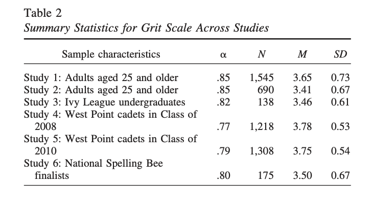
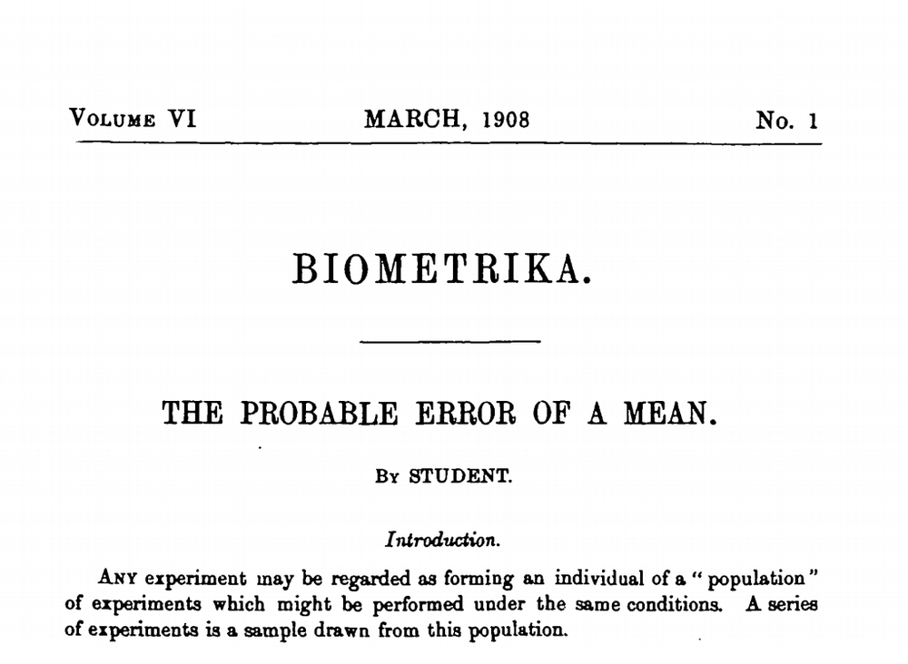
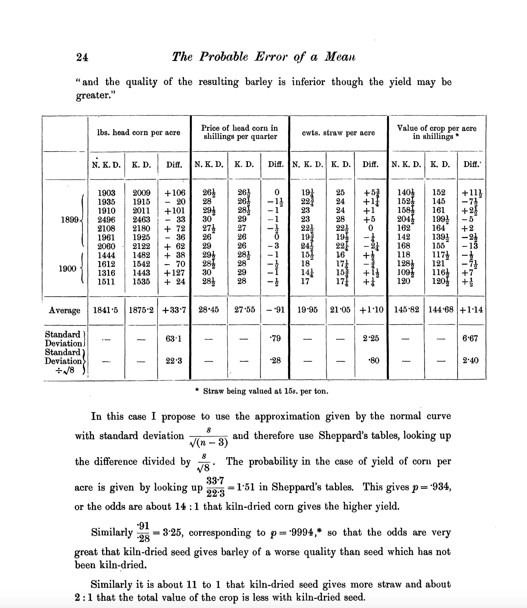

<!-- README.md is generated from README.Rmd. Please edit that file -->

```{r, include = FALSE}
knitr::opts_chunk$set(      
  collapse = TRUE,
  warning = FALSE,  
  comment = "#>",
  message = F,
  dpi = 300
)        

```

## {ggt.test} is a micro package to examine the logic of the t.test.

```{r, eval = T, echo = F}
library(tidyverse)
library(ggt.test)
snapshot <- ggplyr::intercept

chickwts |>
  ggplot() + 
  aes(x = weight) +
  geom_rug() +
  geom_histogram() + snapshot("p1") + 
  geom_support() + snapshot("p2") + 
  geom_mean() + 
  geom_mean_label() + snapshot("p3") +
  stamp_mean(value = 275) + 
  stamp_mean_label(value = 275) + snapshot("p4") +
  geom_tdist_null(value = 275, tails = "none") + snapshot("p5") + 
  geom_tdist_null(value = 275, tails = "both") + snapshot("p6")
```

If we discuss each of the snapshot points, we could write something like this:

```{r, eval = T, echo = F, fig.width=12, fig.height=12}
library(patchwork)

(p1 + p2) / 
(p3 + p4) /
(p5 + p6) +
  patchwork::plot_annotation(
    tag_levels = 1,
    title = "A t.test 'graphical poem' addressing the question: 
    
        Is the observed 'chick weight' different from the historic mean\nof 275 taking a sample of 71 chickens
      ",
    subtitle = "1. Draw 'rug' and stacks (histogram of raw data)
2. Add support - where mean could theoretically lie (without calculating it).
3. Compute mean (balance point) and place it under stupport
4. Place null (look at the initial question, 'differs from 275' in this case)
5. Draw distribution for NULL, a 'student's t' distribution!
6. How much of the distribution lies in the tails - evidence against the null hypothesis"
                             )


```

------------------------------------------------------------------------

# Data

### Scenario 1 📻⏱️

People are played 10 second clip of a song. The are asked to estimate how long the clip played (in seconds).

{width="209"}

<https://unsplash.com/photos/a-woman-with-her-eyes-closed-holding-a-phone-to-her-ear--7Kkov230I0>

<details>

```{r}
library(tidyverse)
time_elapsed_data <- 
  read_csv("https://www.isi-stats.com/isi/data/chap2/TimeEstimate.txt") |>
  janitor::clean_names()

usethis::use_data(time_elapsed_data, overwrite = T)

```

</details>

```{r}
library(ggt.test)
time_elapsed_data 

time_elapsed_data |> 
  pull(estimate) |> 
  mean()
```

### Scenario 2 😮‍💨💪🧗

A random sample of campus students are asked to take the grit survey and report their score. Is there evidence that this student group is different than the West Point Population (2010), whose mean grit score was 3.75.

<https://gwern.net/doc/psychology/personality/conscientiousness/2007-duckworth.pdf>

{width="441"}

<https://unsplash.com/photos/a-group-of-people-hiking-up-a-mountain-lUNh8-Zhqo4>

{width="192"}

{width="509"}

Mean grit score 3.5 for spelling Bee finalists

{width="454"}

Class of 2010 West Point Cadet Grit score mean: 3.75

M is the mean, N is the number of respondants, SD is the Standard deviation for the responses:



<details>

```{r}
grit_summaries <- tribble(~id_study, ~study_full, ~study,  ~pop, ~alpha, ~num, ~mean, ~sd,
              1, "Adults aged 25 and older" ,          "Adults 1", "Adult", .85, 1545, 3.65, 0.73,
              2, "Adults aged 25 and older" ,          "Adults 2", "Adult", .85,  690, 3.41, 0.67,
              3, "Ivy League undergraduates",          "Ivy League", "Ivy Leage", .82,  138, 3.46, 0.61,
              4, "West Point cadets in Class of 2008", "West Point 2008", "West Point", .77, 1218, 3.78, 0.53,
              5, "West Point cadets in Class of 2010", "West Point 2010", "West Point", .79, 1308, 3.75, 0.54,
              6, "National Spelling Bee finalists",    "Spelling Bee", "Spelling Bee", .80,  175, 3.50, 0.67)

usethis::use_data(grit_summaries, overwrite = T)

set.seed(12345)

grit_scores <- grit_summaries |> 
  mutate(scores = purrr::pmap(list(num, mean, sd), rnorm)) |>
  select(-num, -mean, -sd, -id_study) |>
  mutate(westpoint = ifelse(pop == "West Point", "West Point", "Not West Point")) |>
  unnest(scores) 

usethis::use_data(grit_scores, overwrite = T)


grit_undergrad_data <- c(3.18, 2.4, 3.2, 3.16, 3, 3.5, 3.6, 3.4, 3.42, 
                  2.3, 3.46, 2.9, 3.8, 3.35, 3.9, 3.3, 3.29, 3.24, 2.2, 2.8, 4.6) |>
  tibble(score = _)


usethis::use_data(grit_scores, overwrite = T)

  
usethis::use_data(grit_undergrad_data, overwrite = T)

  


```

</details>

```{r}
grit_undergrad_data


grit_undergrad_data |> 
  pull(score) |> 
  mean()
```

### Senario 3 😴🛌 Sleeping 8 hours on average?

<details>

```{r, eval = T}
read_csv("https://www.isi-stats.com/isi/data/chap3/SleepTimes.txt") |> 
  janitor::clean_names() |> 
  rename(hrs_sleep = sleep_hrs) ->
data_hrs_sleep

usethis::use_data(data_hrs_sleep, overwrite = T)
```

</details>

Kids are aIs average hours sleep 8?

```{r}
data_hrs_sleep

data_hrs_sleep |> 
  pull() |> 
  mean()
```

# Step 1. Visualizing raw data

<details>

step 00. cloning statexpress functions

Some convenience functions from {statexpress} are used, because we want this to be a bit more self-contained at this point, so we just clone them for now. statexpress is evolving and is not on CRAN.

```{r statexpress}
qlayer <- function (mapping = NULL, data = NULL, geom = ggplot2::GeomPoint, stat = StatIdentity, 
    position = position_identity(), ..., na.rm = FALSE, show.legend = NA, 
    inherit.aes = TRUE) 
{
    ggplot2::layer(data = data, mapping = mapping, geom = geom, 
        stat = stat, position = position, show.legend = show.legend, 
        inherit.aes = inherit.aes, params = rlang::list2(na.rm = na.rm, 
            ...))
}

qstat <- function (compute_group = ggplot2::Stat$compute_group, ...) 
{
    ggplot2::ggproto(NULL, Stat, compute_group = compute_group, 
        ...)
}

qstat_panel <- function (compute_panel, ...) 
{
    ggplot2::ggproto(NULL, Stat, compute_panel = compute_panel, 
        ...)
}


proto_update <- function (`_class`, `_inherit`, default_aes_update = NULL, ...) 
{
    if (!is.null(default_aes_update)) {
        default_aes <- aes(!!!modifyList(`_inherit`$default_aes, 
            default_aes_update))
    }
    ggplot2::ggproto(`_class` = `_class`, `_inherit` = `_inherit`, 
        default_aes = default_aes, ...)
}

qproto_update <- function (`_inherit`, default_aes_update = NULL, ...) 
{
    proto_update(NULL, `_inherit`, default_aes_update = default_aes_update, 
        ...)
}


```

Now let's see the compute...

```{r viz_raw, echo = T, message=F, warning=F}


compute_balance <- function(data, scales){
  
  data %>% 
    dplyr::summarise(min_x = min(x, na.rm = T),
              xend = max(x, na.rm = T),
              y = 0,
              yend = 0) %>% 
    dplyr::rename(x = min_x)
  
}

#' @export
geom_support <- function(...){
  
  qlayer(geom = GeomSegment, 
         stat = qstat(compute_balance),
         ...)
  
}


compute_stacks <- function(data, scales){
  
  data |> 
    StatBin$compute_group(scales) |> 
    mutate(row = row_number())
  
}

#' @export
geom_stacks <- function(...){
  
  # qlayer(geom = GeomBar |> qproto_update(aes(color = from_theme("ink"))),
  #        stat = StatBin,
  #          # qstat(compute_stacks, aes(group = after_stat(row))),
  #        ...)
  
  stat_bin(geom = GeomBar |> 
             qproto_update(aes(color = from_theme(scales::col_mix(paper,ink)),
                               fill = from_theme(scales::col_mix(paper, ink, .2)))), ...
           )
  
}

```

</details>

```{r}
time_elapsed_data |> 
  ggplot() + 
  aes(x = estimate) + 
  geom_support() + 
  geom_rug(alpha = .5) + 
  geom_stacks() + 
  labs(title = "When a song snippet is played for 10 seconds...",
       subtitle = "how long do people think they've listened?")

time_elapsed_base_plot <- last_plot()

ggplot(grit_undergrad_data) + 
  aes(score) + 
  geom_rug() + 
  geom_stacks() + 
  geom_support() + 
  labs(title = "'Grit' scores on a university campus")

grit_du_base_plot <- last_plot()

```

# Step 2: Visualizing mean and asserted population mean (NULL)

<details>

```{r viz_means}

compute_xmean_at_y0 <- function(data, scales){
  
  data %>% 
    dplyr::summarise(x = mean(x),
              y = 0, 
              label = "^",
              xend = mean(x),
              yend = Inf) 
  
}

#' @export
geom_mean <- function(...){
  list(
    # balancing point
    qlayer(geom = GeomText |> 
             qproto_update(default_aes_update = 
                             aes(size = from_theme(pointsize*4),
                                 vjust = 1,
                                 color = from_theme(colour %||% accent))),
         stat = qstat_panel(compute_xmean_at_y0),
         ...),
    # vline
    qlayer(geom = GeomSegment |> 
             qproto_update(default_aes_update = 
                             aes(linetype = "dashed",
                                 linewidth = from_theme(linewidth),
                                 vjust = 1,
                                 color = from_theme(colour %||% accent))), 
           stat = qstat_panel(compute_xmean_at_y0),
           )
  )
  }


# 5. layer add balancing point value label
compute_xmean_at_y0_label <- function(data, scales){
  
  data %>% 
    dplyr::summarise(x = mean(x),
              y = 0, 
              label = after_stat(round(x, 2))) 
  
}

#' @export
geom_mean_label <- function(...){ 
  qlayer(geom = qproto_update(ggplot2::GeomLabel, 
                              ggplot2::aes(fill = ggplot2::from_theme(colour %||% paper), label.size = NA, vjust = 0, color = ggplot2::from_theme(colour %||% accent)) ),
         stat = qstat_panel(compute_xmean_at_y0_label), 
         ...) 
  }


# 6. Add 'point' for asserted balancing point (null)
compute_panel_prop_asserted <- function(data, scales, value = 0){
  
  # stamp type layer - so ignore input data
  data.frame(y = 0, 
             x = value,
             label = "^",
              xend = value,
              yend = Inf
             )
  
}

#' @export
stamp_mean <- function(value, ...){ 
  
  list(
  qlayer(geom = qproto_update(ggplot2::GeomText, 
                              ggplot2::aes(size = from_theme(pointsize*4),
                                           vjust = 1)),
         stat = qstat_panel(compute_panel_prop_asserted), inherit.aes = F, value = value,
         ...),
    ## vline
    qlayer(geom = GeomSegment |>
             qproto_update(default_aes_update =
                             aes(linetype = "dashed",
                                 vjust = 1)),
           stat = qstat_panel(compute_panel_prop_asserted), inherit.aes = F, value = value, ...
           )
  )
  
  }


# 6. Add label for asserted balancing point (null)
compute_panel_prop_asserted_label <- function(data, scales, value = 0){
  
  # stamp type layer - so ignore input data
  data.frame(y = 0, 
             x = value,
             label = round(value, 2)
             )
  
}

  
#' @export  
stamp_mean_label <- function(value, ...){  
  qlayer(geom = qproto_update(ggplot2::GeomLabel, 
                              ggplot2::aes(fill = ggplot2::from_theme(colour %||% paper), 
                                  label.size = NA, vjust = 0
                                  )),
         stat = qstat_panel(compute_panel_prop_asserted_label), 
         inherit.aes = F, value = value,
         ...)
  }


```

</details>

```{r}
time_elapsed_base_plot + 
  geom_mean() + 
  geom_mean_label() + 
  stamp_mean(10) + 
  stamp_mean_label(10)

time_elapsed_mean_plot <- last_plot() 

grit_du_base_plot + 
  geom_mean() + 
  geom_mean_label() + 
  stamp_mean(3.75) + 
  stamp_mean_label(3.75)

grit_du_mean_plot <- last_plot()
  
```

# Interlude: Individual hypothetical means based on null?

<details>

```{r interlude}
#' @export
data_add_synth <- function(data, var, mean, num_trials = 1){
  
  observed <- data |> pull({{var}})
  
 
    tibble(.trial = 1:num_trials,
           data = rep(list(data), num_trials)) |>
      unnest(data) |> 
    mutate(synthetic = rnorm(
      nrow(data)*num_trials, mean = mean, sd = sd(observed)
      ))
  
}


```

</details>

```{r}

# estimated time elapsed 13.7; true lapsed time 10
time_elapsed_data |> 
  data_add_synth(estimate, mean = 10) |>
  ggplot() + 
  aes(x = synthetic) +
  geom_stacks() +
  geom_mean() + 
  geom_mean_label() +
  stamp_mean(13.7) +  # observed mean
  facet_wrap(~.trial)

last_plot() + 
  time_elapsed_data |>
  data_add_synth(estimate, mean = 10, num_trials = 9)

# sample mean 3.23; asserted 3.75
grit_undergrad_data |> 
  data_add_synth(var = score, mean = 3.75) |>
  ggplot() + 
  aes(x = synthetic) +
  geom_stacks() +
  geom_mean() + 
  geom_mean_label() +
  stamp_mean(3.) +  # observed mean
  facet_wrap(~.trial)
```

# Step 3. Collections of hypothetical means under the 'null', and where does observed mean fit in...

{width="466"}

{width="190"}

<https://www.youtube.com/watch?v=Ea4_eX--mIY>

<https://seismo.berkeley.edu/~kirchner/eps_120/Odds_n_ends/Students_original_paper.pdf>



<details>

```{r tdist}
# 7. normal distribution based on null and n
compute_dist_t <- function (data, scales, value = 3.5, height = NULL, tails = "none")
{
  
  tails <- tails[1]
  
  mean_x <- mean(data$x)
  diff <- mean_x - value
  mirrored <- value - diff
  greater <- max(mean_x, mirrored)
  less <- min(mean_x, mirrored)
  
  height = height %||% 3*nrow(data)/30
  
  out <- seq(-5, 5, 0.01) %>% # 
    # x initially centered at zero
    tibble(x = .) %>% 
    # use the t distribution, centered at zero, with 1 degree of freedom
    mutate(y_density = dt(x, df = length(data$x) - 1)) %>%
    # recalculate x so at centered at 'value' and 
    mutate(x = x * (sd(data$x)/sqrt(length(data$x))) + value) |> 
    mutate(y = height*y_density/max(y_density)) %>% 

    mutate(greater_t = x > mean(data$x),
           less_t = x < mean(data$x),
           two_tail = (x > greater) | (x < less))
  
  out$tails_logical <- F
  out$tails_logical <- if(tails == "none"){FALSE}else{out$tails_logical}
  out$tails_logical <- if(tails == "greater"){out$greater_t}else{out$tails_logical}
  out$tails_logical <- if(tails == "less"){out$greater_t}else{out$tails_logical}
  out$tails_logical <- if(tails == "two.sided"| tails == "both"){out$two_tail}else{out$tails_logical}

  out
  
  
}


#' @export
scale_fill_logical <- function(...){
  scale_fill_manual(values = c(scales::col_mix(theme_get()$geom@ink, 
                                               theme_get()$geom@paper, .6),
                               scales::col_mix(theme_get()$geom@accent, 
                                               theme_get()$geom@paper, .2)), 
                    breaks = c(F,T),
                    guide = "none")
                    }


#' @export
geom_tdist_null <- function(value, ..., tails = NULL){
  
  # aes_greater <- aes(fill = after_stat(greater_tail))
  # aes_less <- aes(fill = after_stat(less_tail))
  # aes_none <- StatIdentity$default_aes
  # aes_both <- aes(fill = after_stat(two_tail))
  # 
  # # if(is.null(tails)d_aes = aes_none
  # if(tails == "two.sided"){d_aes = aes_both}
  # if(tails == "greater"){d_aes = aes_greater}
  # if(tails == "less"){d_aes = aes_less}
  
  list(
  qlayer(geom = qproto_update(ggplot2::GeomArea, 
                              ggplot2::aes(alpha = .66)),
         stat = qstat(compute_dist_t,
                      default_aes = aes(fill = after_stat(tails_logical))), 
         value = value, 
         tails = tails,
         ...),
        scale_fill_logical()
                    
  
  )
  
  }

# # 8. normal distribution mean and sds based on null and n
# compute_dnorm_prop_sds <- function(data, scales, null, dist_sds = -4:4){
#   
#   n <- data |> dplyr::count(.by = x) |> dplyr::pull(n) |> sum()
#   
#   sd = sqrt(null * (1 - null)/n) # sd of the null distribution
#   
#   q <- dist_sds * sd + null
#   
#   data.frame(x = q) %>%
#     dplyr::mutate(height = dnorm(q, sd = sd, mean = null)) %>%
#     dplyr::mutate(height_max = dnorm(0, sd = sd, mean = 0)) %>%
#     dplyr::mutate(y = .55*n*height/height_max) %>% # This is a bit fragile...
#     dplyr::mutate(xend = x,
#            yend = 0)
# 
# }  

# 
# #' @export
# geom_normal_prop_null_sds <- function(...){
#    qlayer(geom = qproto_update(ggplot2::GeomSegment, ggplot2::aes(linetype = "dotted")),
#           stat = qstat_panel(compute_dnorm_prop_sds), 
#           ...)
#   }


```

</details>

```{r}
time_elapsed_mean_plot + 
  geom_tdist_null(value = 12)

grit_du_mean_plot + 
  geom_tdist_null(value = 3.5, tails = "two.sided")

grit_du_mean_plot + 
  geom_tdist_null(value = 3.5, tails = "greater")

grit_du_mean_plot + 
  geom_tdist_null(value = 3.5, tails = "none")

grit_du_mean_plot + 
  geom_tdist_null(value = 3.5, tails = "both")
```


```{r}
# grit_du_mean_plot +
#   stamp_standardized_stat
t.test(x = chickwts$weight, mu = 275)
t.test(x = chickwts$weight, mu = 275, alternative = "less" )

```


# t-test equations?

<details>

```{r stamp_eq_norm_prop, eval = F}
#' @export
stamp_standardized_stat <- function(x = I(.125),
    y = I(.8), size = 3.5){
  
  annotate(
    "text",
    x = x,
    y = y,
    label = latex2exp::TeX("s = \\sqrt{\\frac{\\bar{x}*(\\mu_0)}{n}}", output = "character"),
    parse = TRUE,
    size = size
  )

}
```


</details>

------------------------------------------------------------------------

# Minimal Packaging

```{r, eval = F}
# knitrExtra::chunk_names_get()
knitrExtra::chunk_to_dir("statexpress")
knitrExtra::chunk_to_dir("viz_raw")
knitrExtra::chunk_to_dir("viz_means")
knitrExtra::chunk_to_dir("interlude")
knitrExtra::chunk_to_dir("tdist")
```

```{r, eval = F}
usethis::use_package("dplyr")
usethis::use_package("ggplot2")

devtools::document()
devtools::check(".")
devtools::install(pkg = ".", upgrade = "never")
```
